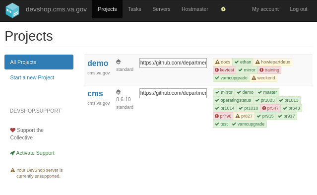
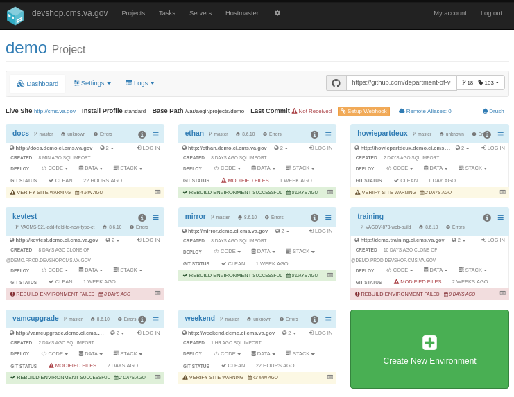
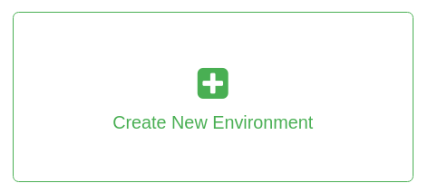
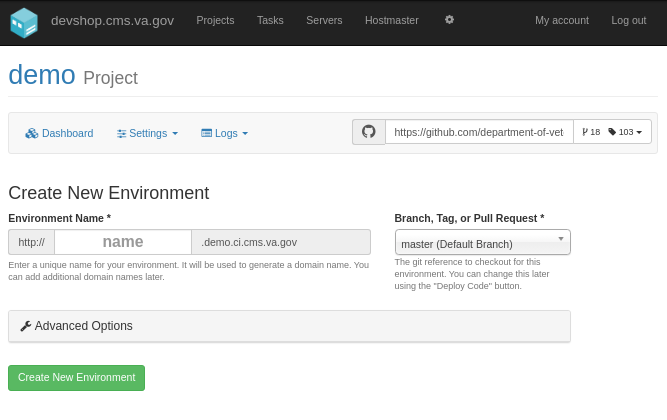
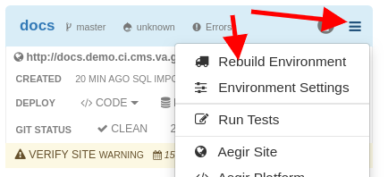
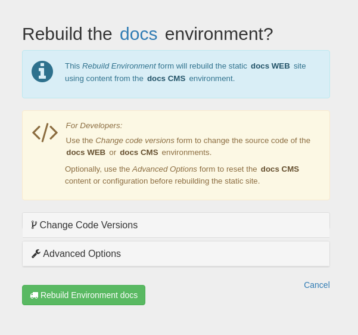
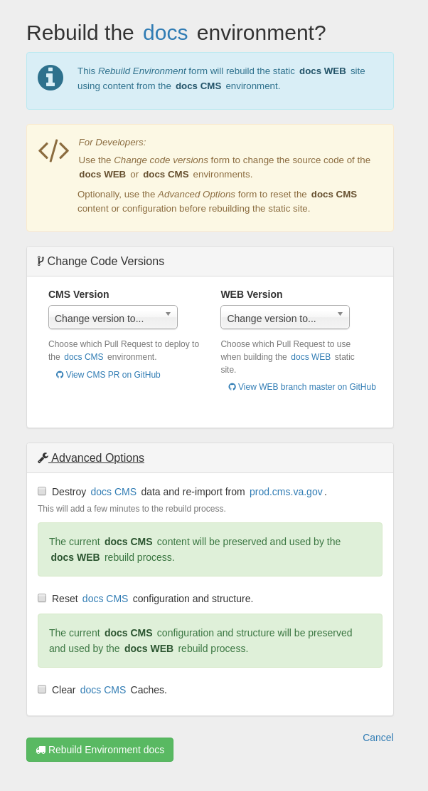
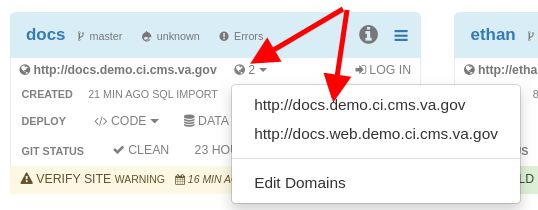

# Environments & the Content Build Process

In order to ensure quality and prevent problems from going to production, multiple 
*Environments* are available to test and review the CMS and WEB sites.

The following table lists all environments and CMS/WEB sites used in the development process for VA.gov:

| Environment       | Drupal (CMS)                                         | Frontend (FE / WEB / Static)                                                        | Management
| -----------       | ------------                                         | ------------------                                                                  | ----------  
| [PROD](1)   Live Site                 | [prod.cms.va.gov](1)            | [www.va.gov](http://www.va.gov)                                                     | [BRD: Jenkins](http://jenkins.vfs.va.gov/job/deploys/view/Prod/job/cms-vagov-prod/)
| [STAGING](2)   Pre-release testing.   | [staging.cms.va.gov](http://staging.cms.va.gov)      | [staging.cms.va.gov](http://staging.va.gov)                                         | [BRD: Jenkins](http://jenkins.vfs.va.gov/job/deploys/view/Staging/job/cms-vagov-staging/)
| [DEV](3)   Latest approved code.      | [dev.cms.va.gov](https://dev.cms.va.gov)             | [dev.cms.va.gov](https://dev.va.gov)                                                | [BRD: Jenkins](http://jenkins.vfs.va.gov/job/deploys/view/Dev/job/cms-vagov-dev/)
| [LOCAL](4)   Local development        | [va-gov-cms.lndo.site](http://va-gov-cms.lndo.site)  | [va-gov-web.lndo.site](http://va-gov-web.lndo.site)   [va-gov-web.lndo.site/static](http://va-gov-web.lndo.site)    [va-gov-web.lndo.site/$URL?_format=static_html](http://va-gov-web.lndo.site/$URL)  
| [CI / PR](1)    Pull Requests & Automated Testing           | pr###.ci.cms.va.gov     |  pr###.web.ci.cms.va.gov    pr###.ci.cms.va.gov/static   pr###.ci.cms.va.gov/$URL?_format=static_html  | [CMS-CI: DevShop](1)     
| [Demos](2)   Demos & Training       | NAME.demo.ci.cms.va.gov |  NAME.web.demo.ci.cms.va.gov    NAME.demo.ci.cms.va.gov/static   NAME.demo.ci.cms.va.gov/$URL?_format=static_html | [CMS-CI: DevShop](1)

## What is an Environment?

*Environments* are just copies of the production site that are running newer
 code or have different content that needs to be tested before going live. 
 
*Environments* can also be used for demonstrations or training, without worrying 
about disrupting production content.
 
Each *Environment* has both a *CMS* and a *WEB* site. The *CMS* is a content management 
system built with Drupal, and the *WEB* site is a static HTML site, built with Metalsmith.

The *WEB* build process consumes the content from the *CMS* in the same environment. 

## Important Concepts

- Each *WEB* site is made up of generated "static" files. This means that the *WEB* site reflects the content from the CMS *at the time the WEB Build process was run*.
- *CMS* Editors will not see changes in the *WEB* site until a "WEB Build" is triggered and the process completes successfully.
- The *WEB* site will not be accessible until at least one "WEB Build" has run successfully. This happens automatically for CI environments, but not yet for Demo environments. If you get an error such as "Forbidden" when visiting the *WEB* site, try running the *Rebuild WEB* process again.

## Creating new Environments

Within the [CMS-CI](1) platform, in the "demo" project, users can "Create New Environments" using the big green button.

### Step-by-step Instructions

1. Visit [http://devshop.cms.va.gov/](http://devshop.cms.va.gov/) and click "G" icon to log in with GitHub.

    

2. Click [demo](http://devshop.cms.va.gov/project/demo) link to visit the "Demos Dashboard".

    
 
3. Scroll down if needed and press the "Create New Environment" button.

    

4. Enter a "name" for your environment, using only letters and numbers, all lowercase.

    

5. If you wish to copy [prod.cms.va.gov](http://prod.cms.va.gov) using the latest content, do not change any additional options. 

    **For advanced users, such as those testing out new functionality:**

    6. If you want to test out the CMS on a developer's branch, click the **Branch, Tag, or Pull Request** field, and start typing the name or pull request title you wish to use.
    7. If you wish to copy a existing demo environment, instead of prod, click **Advanced Options** and select *Clone Environment* under *Install Method*.
    8. If you wish to add additional *Domain Names* to this environment, click  **Advanced Options** and then *Domain Names*. Any extra domain names must be in the pattern "*.ci.cms.va.gov".

9. Finally, Press the "Create New Environment" button. After about 10-15 minutes, you will have a running site!
10. Click the URLs for your environment to visit, once "install" step is complete.

    

**NOTE:** The WEB site for this environment will not work until you trigger a WEB Build process.

## WEB Build Process

Within each environment, the static HTML for the *WEB* site is occasionally 
"rebuilt" so that the latest content from that environment's *CMS* is used.

The *WEB* build process is tested in the CI system to ensure compatiblity with the
 CMS content schema.
 
The *WEB* build process is triggered automatically by certain actions in the CMS 
or manually via the [command line](#cli-build) or the [DevShop Dashboard](1).
 
### Build Triggers

The *WEB* instance of an environment is rebuilt when any of the following actions take place in the *CMS*:

- Alert content is created or updated.
- The "Rebuild WEB" button is pressed.
- @TODO: Document all current build triggers.

*Note to Developers:* Keep this list up to date to help content editors understand the process. 

### Rebuilding Environments Manually

There is a special button and form for rebuilding VA.gov environments. Use this 
to manually trigger either a WEB or CMS rebuild (or both), and optionally check 
out different code.

#### Step-by-step Instructions

1. Find the environment you would like to build in the [CMS-CI](1) site.
2. Click the "Hamburger Menu" button, then the "Rebuild Environment" button.

    

3. If you wish to just trigger a WEB rebuild with the existing content, do not change any other options.

    

    **For advanced users and developers:**
    
    1. If you wish to change the branch of the CMS or WEB, click "Change Code Versions".
    2. If you wish to reset your environment's Content or Configuration, click "Advanced Options".

    

4. Press the "Rebuild Environment" button.
5. Once the REBUILD process is complete, you can click the "WEB" site link for the environment in the DevShop UI.

    

6. That's it! If the process completed, you should see a site that looks like VA.gov.
   
  

## Hosting Architecture

All environments are hosted on VA GovCloud in AWS GovCloud.

The primary environments, DEV, STAGING, and PROD, are hosted in the *BRD* system.

Pull Request Environments and Ad Hoc environments are hosted in the *CMS-CI* system.

SOCKS proxy or PIV+GFE hardware is required for accessing VA internal network.

### BRD: Jenkins

> Build, Release, Deploy
 
[jenkins.vfs.va.gov](http://jenkins.vfs.va.gov/)

  * Source Code: https://github.com/department-of-veterans-affairs/devops/tree/master/ansible/build/roles/cms
  * Runs Continuous Integration for about a dozen different applications with different requirements, including `vets-website`, `vets-api`, `cms`, and soon `cms-ci`.
  * BRD Process is standardized across apps using Ansible playbooks and roles. See the [DevOps Repo Documentation](https://github.com/department-of-veterans-affairs/devops/blob/master/README.md) for more information.
    * The "Build" process creates the entire server image and permantently tags and archives it as an AMI.
    * The "Deploy" process delivers those images to the 3 "environments", *DEV, STAGING, and PROD* and runs whatever 
      hooks are needed. 
    * The "Release" process continuously delivers code to each BRD Environment
    
        - Primary branch commits are automatically deployed to DEV and STAGING Environments. 
        - Git Tags and GitHub Releases are created automatically if those commits pass testing.
        - "Environments" in the context of **BRD** are really different networks. 
        - The "servers" that actually run the apps are activated AMI images, placed into the desired "environment".
        
###CMS-CI: DevShop 

> Open Source Drupal CI Platform

[devshop.cms.va.gov](http://devshop.cms.va.gov)
  
  * *CMS-CI* refers to the VA's implementation of DevShop. There are some extra modules and settings that are added to 
      DevShop specific for the VA. The extra tools are contained in the [CMS-CI role in the DevOps Repo]().
  * Provides an environment per Pull Request, and allows creation of ad-hoc environments with any name, on any desired 
    branch or Pull Request.
  * Provides a Web UI for getting information and managing these environments
  * Installed with open source Ansible roles, plus a custom playbook. 
  * Deployment of new releases of CMS-CI and DevShop is handled by BRD in way very similar to CMS.
  * Provides a complete SDLC pipeline for Drupal code: 
      * Creates new environments when a PR is open.
      * Automatically tests the environment and passes status to GitHub to allow or block merging.
      * Destroys and rebuilds PR Environments and runs the full test suite again on every git push.
      * If the PR is merged or closed, environment is destroyed.
      * Notifies GitHub of deployment success or failure, with lnks to the environments.
  * Includes the FE/WEB Build process in the Drupal CI pipeline.
      * Front-end WEB project is built inside PR environments automatically.
      * End-to-end testing of CMS+WEB with Behat: 
        1. Make CMS updates: Change content, publish state, etc.
        1. Run WEB build command to rebuild static assets.
        1. Confirm CMS change is visible in WEB static assets.
  * Runs on a single EC2 instance.
        
# Resources

- https://va-gov.atlassian.net/wiki/spaces/VAGOV/pages/103448589/VA.gov+CMS+DevOps+2.0+Architecture+Notes
- https://va-gov.atlassian.net/wiki/spaces/VAGOV/pages/28770332/CMS+Infrastructure+CI+CD+Architecture+Proposal+3

[Table of Contents](../README.md)

[1]: http://devshop.cms.va.gov
[2]: http://devshop.cms.va.gov/project/demo
